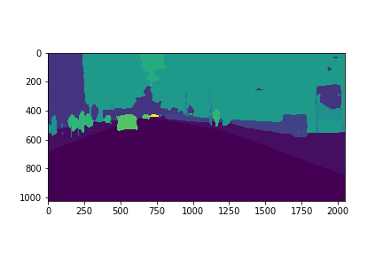
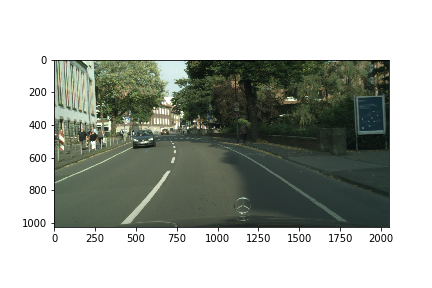

# DeepLab V3

## Overview
This project implements the [DeepLab V3 architecture](https://arxiv.org/abs/1706.05587) for the semantic image segmentation task trained and evaluated using the [Cityscapes dataset](https://www.cityscapes-dataset.com/). It uses atrous convolutions in both the ResNet-101 backbone architecture and atrous spatial pyramid pooling layer. This implementation has been built using the PyTorch framework.

## How to run
In order to run the project, use the following command:

```
python main.py <dataset-folder> <model-checkpoint-folder> <losses-folder> --is-training-model
```

In order to evaluate the project, use the following command:

```
python main.py <dataset-folder> <model-checkpoint-folder> <losses-folder> --is-evaluating-model --checkpoint-path <checkpoint-path>
```

Note that in both cases, the three required arguments are defined as follows:
1) **dataset-folder**: The path of the Cityscapes dataset
2) **model-checkpoint-folder**: The path to save model checkpoints every 5 epochs. This can be changed using the `--save-checkpoint-index` option
3) **losses-folder:** The path to save the average training and validation losses every 5 epochs.  This can be changed using the `--save-checkpoint-index` option

## Training protocol
In this project, I used a momentum of `0.9`, weight decay of `5e-4`, and a polynomial learning rate scheduler as defined in the paper. The model has been trained for 65 epochs using the learning rate of `1e-2`. Then, the last 5 epochs has been trained using a learning rate of `1e-3`.

## Final score
In this project, I am able to achieve a mean intersection over union score of **0.700**.

## Model checkpoint
Since the model checkpoint file is quite large of a size, I have placed it in a public Dropbox folder found [here](https://www.dropbox.com/sh/u31sx5ahu91w9o7/AABVsUwJkpslm5QXAgk_0wOea?dl=0). In order to load this, place this inside `<model-checkpoint-folder>` and pass the filename without the extension to the `--checkpoint-path` option.

## Example
Here is an example of a mask produced by the model shown alongside the original image:
 
